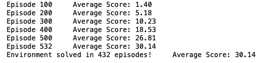
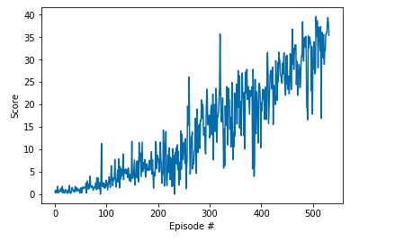

# Reacher
This project repository is created to show my solution for Udacity's [Deep Reinforcement Learning Nanodegree](https://www.udacity.com/course/deep-reinforcement-learning-nanodegree--nd893)
Project 2: Continuous Control.

## Environment
In this project agent is trained to navigate and collect bananas in a large, square world.


In this environment, a double-jointed arm can move to target locations. A reward of +0.1 is provided for each step that the agent's hand is in the goal location. Thus, the goal of your agent is to maintain its position at the target location for as many time steps as possible.

The observation space consists of 33 variables corresponding to position, rotation, velocity, and angular velocities of the arm. Each action is a vector with four numbers, corresponding to torque applicable to two joints. Every entry in the action vector should be a number between -1 and 1.

The task is continuous, and in order to solve the environment, **agent must get an average score of +30 over 100 consecutive episodes.**

## Getting Started
- First of all you need to configure a Python 3.6 environment with the needed requirements as described in below:
1. Create (and activate) a new environment with Python 3.6.

	- __Linux__ or __Mac__: 
	```bash
	conda create --name drlnd python=3.6
	source activate drlnd
	```
	- __Windows__: 
	```bash
	conda create --name drlnd python=3.6 
	activate drlnd
	```
	
2. Follow the instructions in [this repository](https://github.com/openai/gym) to perform a minimal install of OpenAI gym.  
	- Next, install the **classic control** environment group by following the instructions [here](https://github.com/openai/gym#classic-control).
	- Then, install the **box2d** environment group by following the instructions [here](https://github.com/openai/gym#box2d).
	
3. Clone the repository (if you haven't already!), and navigate to the `python/` folder.  Then, install several dependencies.
```bash
git clone https://github.com/udacity/deep-reinforcement-learning.git
cd deep-reinforcement-learning/python
pip install .
```

4. Create an [IPython kernel](http://ipython.readthedocs.io/en/stable/install/kernel_install.html) for the `drlnd` environment.  
```bash
python -m ipykernel install --user --name drlnd --display-name "drlnd"
```

5. Before running code in a notebook, change the kernel to match the `drlnd` environment by using the drop-down `Kernel` menu. 
- Clone this project and make it accesible in your Python environment
- Then you have to install the Unity environment as described in the below:
    - Download the environment that matches your operating system:
        - Linux: [click here](https://s3-us-west-1.amazonaws.com/udacity-drlnd/P1/Banana/Banana_Linux.zip)
        - Mac OSX: [click here](https://s3-us-west-1.amazonaws.com/udacity-drlnd/P1/Banana/Banana.app.zip)
        - Windows (32-bit): [click here](https://s3-us-west-1.amazonaws.com/udacity-drlnd/P1/Banana/Banana_Windows_x86.zip)
        - Windows (64-bit): [click here](https://s3-us-west-1.amazonaws.com/udacity-drlnd/P1/Banana/Banana_Windows_x86_64.zip)
        
       Then, place the file in the ```environments/``` folder
       
## Report
### Algorithm
The agent is trained by using one of the Actor-Critic methods: Deep Deterministic Policy Gradient (DDPG) algorithm. The deep neural network has following layers:
```bash
  Actor
  
    - Fully Connected Layers (input: 33, output: 128)
    - Fully Connected Layers (input: 128, output: 64)
    - Fully Connected Layers (input: 64, output: 4)
    
  Critic
  
    - Fully Connected Layers (input: 33, output: 128)
    - Fully Connected Layers (input: 132, output: 128)
    - Fully Connected Layers (input: 128, output: 1)
```
```bash
Parameters:
 
    - Gamma: 0.99
    - Actor Alpha (Learning Rate): 0.001
    - Critic Alpha (Learning Rate): 0.001
    - Epsilon: 1.0
    - Epsilon Decay: 1e-6
    - Replay Buffer Size: 100000
    - Batch Size: 64
    - Update Every: 4
```   
### Results



### Future Works
    - PPO
    - A2C
    - A3C
    - Train for 20 Arms
